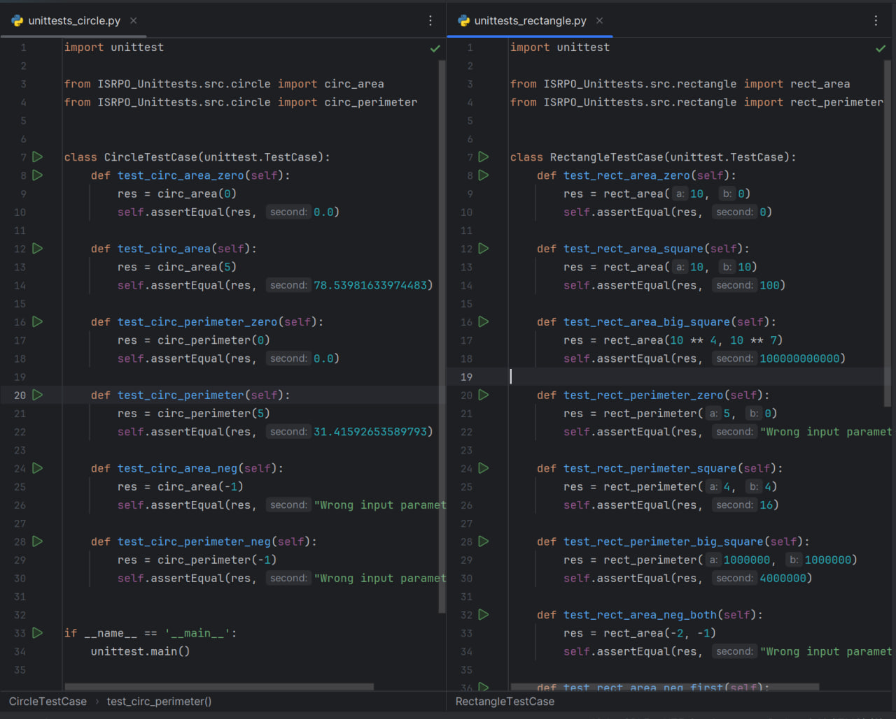
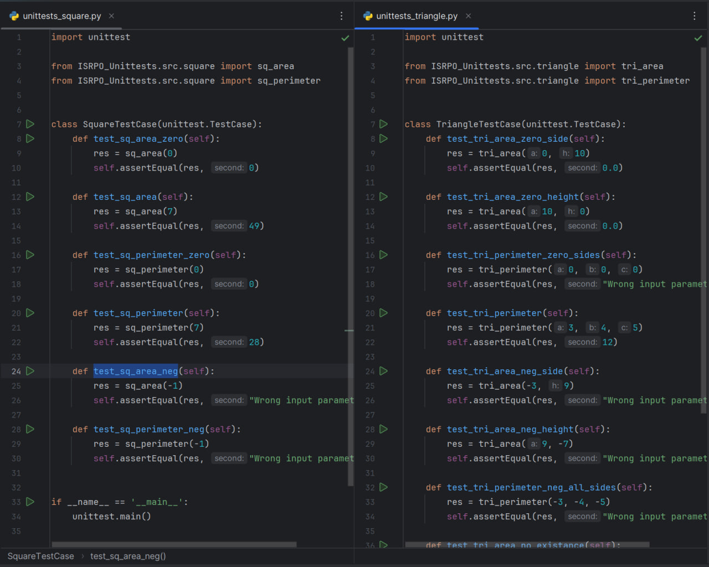

# Repository with .py files for counting areas and perimiters of triangle, square and rectangle

## Documentation is an integral part of any IT product and we will enrich our project with it both with separate documentation and implement it into the source code.
1. Each declaration of a function in the project files should begin with a comment block that describes the function itself and an example of its call.\
2. The docs directory should appear in the project structure, which should contain documentation on the project written in markdown notation (read more about it here), which includes the following sections:\
- general description of the solution 
- description of each function with call examples
- project modification history with commit hashes (except for the last entry)

## Math formulas, used in files:
### Area
- Circle: S = πR²
- Triangle: S = ah/2
- Rectangle: S = ab
- Square: S = a²

### Perimeter
- Circle: P = 2πR
- Triangle: P = a + b + c
- Rectangle: P = 2a + 2b
- Square: P = 4a

## General description of the solution:

### Files situated in the repository:
- rectangle.py
- triangle.py
- square.py
- circle.py
- \docs\README.md

## Functions' descriptions:

## rectangle.py

### Area:
Takes the numbers a and b, returns their product\
Parameters:\
- a (int, float, etc...) first number
- b (int, float, etc...) the second number
Return value:\
- a_b_multiplied (int, float, etc...) product of numbers a and b
Example of a function call:\
- input >> 2, 3
- output << 6

### Perimeter:
Takes the numbers a and b, returns their doubled sum\
Parameters:\
- a (int, float, etc...) first number
- b (int, float, etc...) the second number
Return value:\
- a_b_summa_doubled (int, float, etc...) the doubled sum of the numbers a and b
Example of a function call:\
- input >> 2, 3
- output << 10

## square.py

### Area:
Takes a number n, returns its square\
Parameters:\
- a (int, float, etc...) number
Return value:\
- a_squared (int, float, etc...) the square of the number a
Example of a function call:\
- input >> 2
- output << 4

### Perimeter:
Takes the number n, returns it multiplied by 4\
Parameters:\
- a (int, float, etc...) number
Return value:\
- a_multiplied_by_4 (int, float, etc...) the number a multiplied by 4
Example of a function call:\
- input >> 2
- output << 8

## triangle.py

### Area:
Accepts the numbers a and h, returns their semi-reproduction\
Parameters:\
- a (int, float, etc...) the first number
- h (int, float, etc...) the second number
Return value:\
- a_h_multiplied_half (int, float, etc...) semi-reproduction of numbers a and h
Example of a function call:\
- input >> 2, 3
- output << 3

### Perimeter:
Accepts the numbers a b and c, returns their sum\
Parameters:\
- a (int, float, etc...) first number
- b (int, float, etc...) the second number
- c (int, float, etc...) the third number
Return value:\
- a_b_c_summ (int, float, etc...) sum of numbers a,b,c
Example of a function call:\
- input >> 3, 4, 5
- output << 12

## circle.py

### Area:
*import the math library to get the number pi\
Takes the number r, returns its square multiplied by pi\
Parameters:\
- r (int, float, etc...) first number
Return value:\
- a_squres_multiplied_by_pi (float, etc...) the square of the number r multiplied by the number pi
Example of a function call:\
- input >> 3
- output << 28.274333882308138

### Perimeter:
*import the math library to get the number pi\
Takes the number r, returns it multiplied by twice the number pi\
Parameters:\
- r (int, float, etc...) first number
Return value:\
- a_multiplied_by_double_pi (float, etc...) the number r multiplied by twice the number pi
Example of a function call:\
- input >> 2
- output << 12.566370614359172

## Git commits hashes:
- commit 226288e0efeca62cd658beed94c6031031fdb8dc (HEAD -> labwork2)\
Author: Alexander Kim <limosha@inbox.ru>\
Date:   Sat Oct 7 09:57:29 2023 +0300\

    modified 4 .py files

- commit 69e6f4c1fdaf8c880be2eddf306d1866a32ad187 (origin/new_features_391091, origin/main, origin/HEAD)\
Author: Alexander Kim <limosha@inbox.ru>\
Date:   Tue Sep 19 14:05:34 2023 +0300\

    mistake in rectangle.py was fixed

- commit e46bba849a8e8a20002517f1fc95517f0ebedbd8\
Author: Alexander Kim <limosha@inbox.ru>\
Date:   Tue Sep 19 13:59:01 2023 +0300\

    second file was added

- commit bad1e46e80ed1cb428a30286f8db7e4ae7947114\
Author: Alexander Kim <limosha@inbox.ru>\
Date:   Tue Sep 19 13:55:22 2023 +0300\

    new file was added

- commit d078c8d9ee6155f3cb0e577d28d337b791de28e2\
Author: smartiqa <info@smartiqa.ru>\
Date:   Thu Mar 4 14:55:29 2021 +0300\

    L-03: Docs added

- commit 8ba9aeb3cea847b63a91ac378a2a6db758682460\
Author: smartiqa <info@smartiqa.ru>\
Date:   Thu Mar 4 14:54:08 2021 +0300\

    L-03: Circle and square added

## Additional info:

This documentation was modified using [Visual Studio Code](https://code.visualstudio.com/).

> [!NOTE]
> This file stores the history of changes to the project with the hashes of the comits except the last one.

# Labwork №4
## Progress of work: 
### 1. Define the goals and objectives of testing: 

Testing objectives:
- Ensuring the quality of software (software).
- Preventing the detection of errors at the stage of actual software operation.
- Conformity assessment ACCORDING to the specified requirements and criteria.
- Ensuring the control of changes in software and documentation.
- Evaluation of the reliability and stability of the software.
- Software performance improvement.
- Improving the security level of the software.

Testing tasks:
- Compliance testing ACCORDING to the specified requirements and criteria.
- Evaluation of the functionality and reliability of the software.
- Checking the performance of critical functions and tasks.
- Identification of errors, vulnerabilities and software flaws.
- Assessment of the current state of the software and development of a strategy to fix the detected problems.
- Software compatibility testing with various operating systems, hardware platforms and network configurations.
- Evaluation of software performance and development of a strategy to optimize its operation.
- Testing for compliance with the requirements of accessibility, quality of user support and the ability to adapt the software to changing requirements.
- Assessment of compliance with the requirements of regulatory documents, standards and rules in the field of information security.
- Software compatibility testing with other software components and systems.

### 2. Let's make a description of the product under test:
A set of files in Python, each file is a set of functions for calculating the area and perimeter of a certain geometric shape. There are 4 files in total, hence 4 shapes: circle, rectangle, square, triangle. A description of the operation of a certain function is already included in the body of each of them. Functions do not accept string values of variables. Product requirements – do not violate the configuration of the function and do not change their description. 

### 3. Define the testing areas:
Testing is carried out for each function from a given set. There are two functions in each file. Tests are written for each component of the final product. Testing will cover all functions for calculating the area and perimeter of a circle, rectangle, square and triangle.

### 4. Testing methods used: 
- Testing principle: comprehensive testing: This principle emphasizes the importance of thorough testing, including extreme cases. The "white box" approach will be used, since the code of the functions is known. Testing will be conducted using unit testing (Unittest) in Python.

- Testing strategy: Boundary value analysis: This strategy involves defining and testing the boundary values of the input domain to make sure that the function under test handles these values correctly.

### 5. Test acceptance criteria:
All tests, subject to their correct input data, must pass. If the input data is correct, then none of the functions should raise exceptions. 
Tests with incorrect input data may not be passed.

### 6. Expected results:
Results: it is expected that all functions will work correctly with valid input data and handle exceptions with non-valid output data normally. As a result of testing, reports on the testing states (passed/failed) for each function should be received. Defect reports will be displayed in the console after testing, cases will be corrected until the erroneous results are completely eliminated. In addition, a metric of the importance of tests in each category of program performance analysis will be generated. The test execution statuses and the priority of the tests will be further reflected in the final report.

### 7. Testing analysis:

- First, let's analyze the test results. Let's make sure that the unit tests cover all possible code paths, boundary cases, and exception handling scenarios.

- Secondly, if there are any failed tests, we will carefully study the cause of the failure. Common causes of failed tests include incorrect test data, unreliable tests, and incomplete code coverage.

- We will make the necessary corrections based on the analysis. For example, if tests fail due to incorrect test data, update the test data to bring it in line with the expected result.

- If the test fails due to problems, we will investigate the root cause of the problems and make corrections accordingly. Problems can often be reduced by improving the overall design and reliability of the software.

- After passing all the tests, we will make sure that the test coverage meets pre-defined criteria. If not, we'll add more tests to improve coverage.

- Finally, we will document the test results. This will help identify any areas for improvement and contribute to ensuring the quality of the product.

- It is important to remember that the approach may vary depending on the specific requirements and context of the software project.

> [!NOTE]
> The final test report is in the file __Unittests report.xlsx__

## Tests code:

### Circle & Rectangle Unittests

### Square & Triangle Unittests
