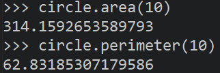
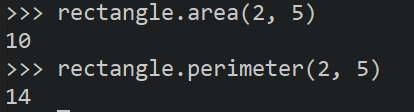
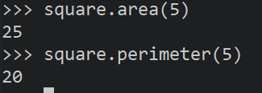
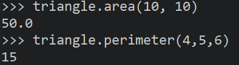
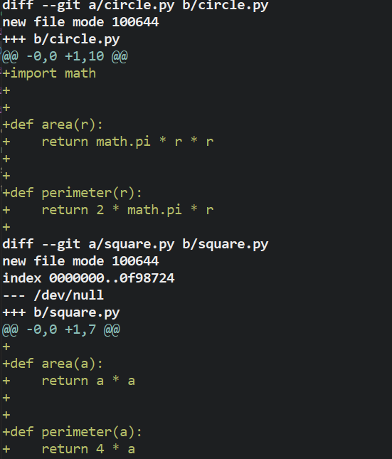
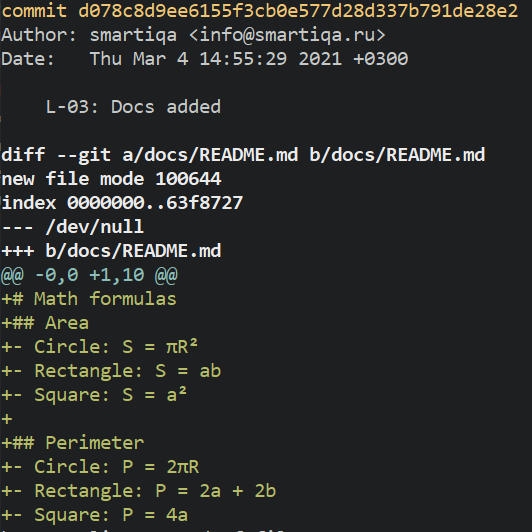
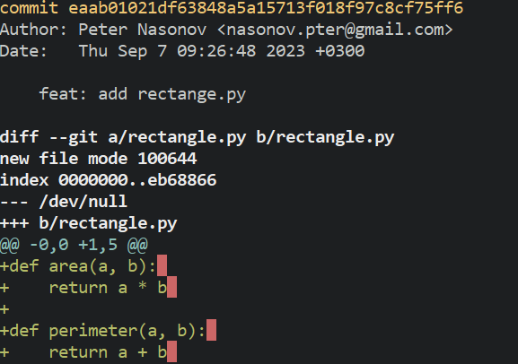
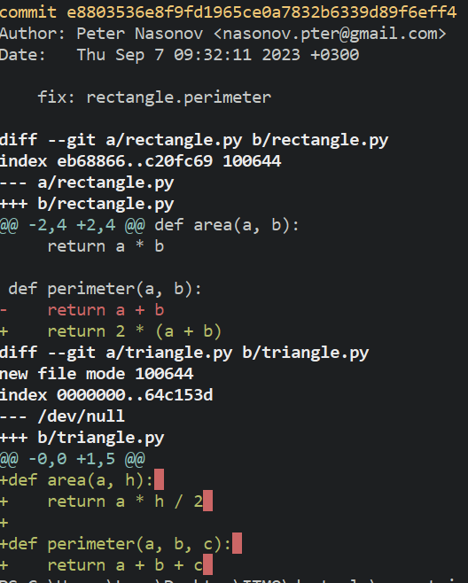

# Common solution explanation
## Area
- Circle: S = πR²
- Rectangle: S = ab
- Square: S = a²
- Triangle: S = a * h / 2

## Perimeter
- Circle: P = 2πR
- Rectangle: P = 2a + 2b
- Square: P = 4a
- Triangle: P = a + b + c

# Function explanation
## 1. circle
### area(r)
    Принимает одно число: радиус окружности.
    возвращает приближительное значение площади круга в типе данных float
### perimeter(r)
    Принимает одно число: радиус окружности.
    возвращает приближительное значение длины круга в типе данных float

## 2. rectangle
### area(a, b)
    Принимает два числа: длины сторон прямоугольника.
    Возвращает площадь фигуры

### perimeter(a, b)
    Принимает два числа: длины сторон прямоугольника.
    Возвращает периметр фигуры

## 3. square
### area(a)
    Принимает одно число: длину стороны квадрата.
    Возвращает площадь фигуры

### perimeter(a)
    Принимает одно число: длину стороны квадрата.
    Возвращает периметр фигуры

## 4. triangle
### area(a, h)
    Возвращает площадь треугольника по длинам стороны и высоты отложенной от этой стороны.
    
        Параметры:
            - a (int/float): длина стороны треугольнка
            - h (int/float): длина высоты треугольника отложенной от стороны a
    
        Возвращаемое значение:
            area (int/float): результат

### perimeter(a, b, c)
    Возвращает периметр треугольника по длинам трех сторон.
    
        Параметры:
            - a (int/float): длина первой стороны треугольнка
            - b (int/float): длина второй стороны треугольнка
            - c (int/float): длина третей стороны треугольнка
    
        Возвращаемое значение:
            perimeter (int/float): результат

# Project history

## 1. Author's functions and files
### circle and square add   commit: `8ba9aeb`

### docs add   commit: `d078c8d`

## 2. Forked to my repo
### add rectangle.py   commit: `eaab010`

### fix rectangle.py perimeter and add triangle.py   commit: `e880353`
